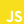

# Chatbot

## Working principle of bot

 

---

## Languages and Tools

 
 

---

## Authors
- Oliver Kovacs
    - [Github](https://github.com/OliverKovacs)
    - [Email](mailto:oliver.kovacs.dev@gmail.com)
- Ulrich Barnstedt
    - [Github](https://github.com/ulrich-barnstedt)
    - [Email](mailto:0x81.dev@gmail.com)
- Hanna Inselsbacher

 

---

## Legal Notice

By using this program you agree to:
- Dialogflows [terms of service](https://cloud.google.com/dialogflow/docs/terms-trial-edition)
- Symptomas [terms of service](https://www.symptoma.com/en/terms) and [privacy policy](https://www.symptoma.com/en/privacy)
- The WHOs [privacy policy](https://www.who.int/about/who-we-are/privacy-policy)
- The Wikimedia [terms of use](https://foundation.wikimedia.org/wiki/Terms_of_Use/en) and [privacy policy](https://foundation.wikimedia.org/wiki/Privacy_policy)