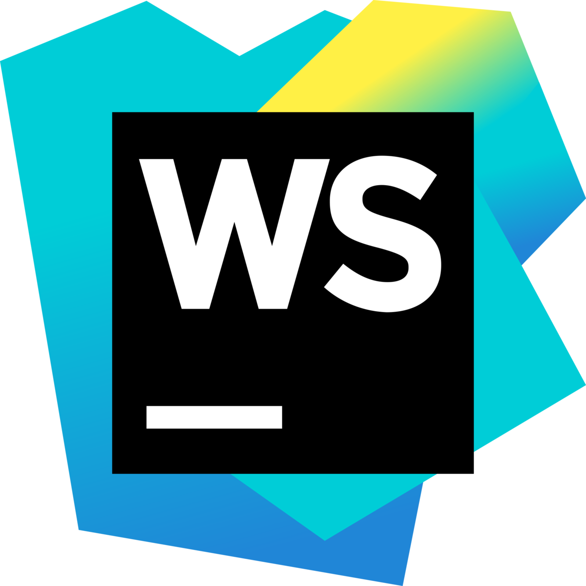

# Wilson

Wilson is a chatbot that can diagnose you based on your symptoms and give you information on illnesses.

Wilson uses DialogFlow for natural language processing (NLP), Symptoma for the diagnosis and the WHOs International Classification of Diseases (ICD) and Wikipedia as sources.
It is written in JavaScript and can be run online in Repl, local with Node.js or in a Docker container.

>> GIF goes here

---

## Table of contents

- [Run](#run)
- [Details](#details)
- [Languages and Tech](#languages-and-tech)
- [Authors](#authors)
- [Roadmap](#roadmap)
- [Disclaimer](#disclaimer)
- [Legal notice](#legal-notice)

## Run
The bot can be run in a variety of environments with different frontends.

### Running in Repl:
Go to https://repl.it/@OliverKovacs/wilson#README.md  
Click `run`

### Running locally:
Clone the repo at https://github.com/hiubok/wilson.git  
Open a terminal in the cloned repo  
Run the command `npm install`  
Start the bot with `npm run cli`

## Details
Details on how the bot works.

### General working principle
The diagram below demonstrates how the bot processes input and how it obtains relevant data.

### Frontends
The bot itself is a separate module, which can have multiple frontends.  
The command line interface for example is a frontend for the bot (see [run](#run) on how to start it), but frontends can be built for any platform.  
An example also provided in the repo is a discord integration, which allows the bot to run as an discord bot. It can be run with `npm run dc` (after putting a valid discord token in `/dc/token.txt`).

## Languages and tech
The bot itself is written completely in javascript, plus some configuration in DialogFlow.
We used these technologies to create the bot (click on an icon for more info):

 

## Authors
- Oliver Kovacs
    - [Github](https://github.com/OliverKovacs)
    - [Email](mailto:oliver.kovacs.dev@gmail.com)
- Ulrich Barnstedt
    - [Github](https://github.com/ulrich-barnstedt)
    - [Email](mailto:0x81.dev@gmail.com)
- Hanna Inselsbacher

## Roadmap
- Add further dialogues to DialogFlow
- Create integrations for other platforms apart from discord
- Add further sources for researching info on illnesses
- Create support for other languages than english

## Disclaimer
The bot does not replace an actual diagnose by a certified medical professional, and replies and diagnoses may be inaccurate.  
Do NOT rely on the data provided by the bot for real world use, this is a work in progress, proof-of-concept project.

## Legal Notice

By using this program you agree to:
- Dialogflows [terms of service](https://cloud.google.com/dialogflow/docs/terms-trial-edition)
- Symptomas [terms of service](https://www.symptoma.com/en/terms) and [privacy policy](https://www.symptoma.com/en/privacy)
- The WHOs [privacy policy](https://www.who.int/about/who-we-are/privacy-policy)
- The Wikimedia [terms of use](https://foundation.wikimedia.org/wiki/Terms_of_Use/en) and [privacy policy](https://foundation.wikimedia.org/wiki/Privacy_policy)